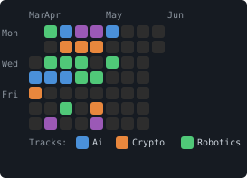

# build-everyday

<!-- BADGES:START -->
   
<!-- BADGES:END -->

Daily coding across AI, crypto, and robotics. One commit a day, every day.

## Structure

```
day-XXX-topic/
  README.md    -- challenge description
  solution.*   -- implementation
```

## Tracks

| Day | Mon | Tue | Wed | Thu | Fri | Sat | Sun |
|-----|-----|-----|-----|-----|-----|-----|-----|
| Track | AI | Crypto | Robotics | AI | Crypto | Robotics | Integration |

## Progression

**Weeks 1-4** — Fundamentals
- AI: ML from scratch (regression, trees, neural nets)
- Crypto: Primitives (hashing, signing, Merkle trees)
- Robotics: Control systems (PID, state machines)

**Weeks 5-8** — Building
- AI: LLM applications (prompt chains, RAG, agents)
- Crypto: Smart contracts (Solidity, testing, deployment)
- Robotics: Path planning & simulation (A*, RRT, PyBullet)

**Weeks 9-12** — Advanced
- AI: Computer vision, reinforcement learning
- Crypto: DeFi protocols, on-chain analytics
- Robotics: Sensor fusion, SLAM

**Week 13+** — Integration projects combining multiple tracks

<!-- HEATMAP:START -->

<!-- HEATMAP:END -->

<!-- STREAK:START -->
### 🔥 Current Streak: 3 days | Longest: 5 days
<!-- STREAK:END -->

<!-- PROGRESS_BARS:START -->
**AI         ** `██████████████████░░ 22/24`  
**Crypto     ** `██████████░░░░░░░░░░ 12/24`  
**Robotics   ** `█████████████░░░░░░░ 16/24`  
**Integration** `████████░░░░░░░░░░░░ 5/12`  

**Total LOC**: 36,982 lines across 59 solutions
<!-- PROGRESS_BARS:END -->


## Dashboard

| Week | Mon (AI) | Tue (Crypto) | Wed (Robotics) | Thu (AI) | Fri (Crypto) | Sat (Robotics) | Sun (Integration) |
|------|----------|--------------|-----------------|----------|--------------|-----------------|-------------------|
| 1 | — | [001](day-001-linear-regression/) | [002](day-002-sha256-hash/) | [003](day-003-logistic-regression/) | — | [004](day-004-decision-tree/) | [005](day-005-kmeans-clustering/) |
| 2 | [006](day-006-pid-controller/) [007](day-007-state-machine/) | — | [008](day-008-kinematics/) | [009](day-009-knn-classifier/) | — | — | [010](day-010-crypto-price-predictor/) |
| 3 | [012](day-012-naive-bayes/) | [013](day-013-merkle-tree/) [020](day-020-digital-signatures/) | [014](day-014-motor-control/) [021](day-021-line-following-robot/) | [015](day-015-neural-network-forward/) | — | [016](day-016-sensor-simulator/) [017](day-017-obstacle-avoidance/) | [011](day-011-ml-object-follower/) [018](day-018-onchain-ml-registry/) [019](day-019-trading-bot-skeleton/) |
| 4 | — | [027](day-027-proof-of-work/) | [022](day-022-servo-control/) [028](day-028-astar-pathfinding/) | — | [029](day-029-hello-solidity/) [030](day-030-erc20-token/) [031](day-031-erc721-nft/) | — | [024](day-024-blockchain-sensor-integrity/) [025](day-025-anomaly-blockchain-audit/) [026](day-026-signed-robot-commands/) |
| 5 | [033](day-033-prompt-chaining/) | [036](day-036-hardhat-testing/) [037](day-037-dex-swap-contract/) [038](day-038-staking-contract/) [039](day-039-multisig-wallet/) | [034](day-034-rrt-path-planning/) | — | [040](day-040-flash-loan-basics/) | — | [032](day-032-oracle-ml-contract/) |
| 6 | — | — | [041](day-041-maze-solver/) [042](day-042-robot-arm-trajectory/) [043](day-043-swarm-behavior/) [044](day-044-slam-concept/) [045](day-045-kalman-filter/) | [046](day-046-rag-pipeline/) | — | — | — |
| 7 | — | — | — | [047](day-047-embeddings-vector-search/) [048](day-048-tool-using-llm-agent/) [049](day-049-finetune-sentiment/) [050](day-050-multi-agent-conversation/) | [051](day-051-amm-constant-product/) | — | — |
| 8 | [054](day-054-structured-output-extraction/) [055](day-055-cnn-image-classifier/) [056](day-056-object-detection/) | — | — | — | — | — | — |
| 9 | [057](day-057-reinforcement-q-learning/) [058](day-058-policy-gradient/) [059](day-059-transformer-attention/) [060](day-060-diffusion-image-gen/) [061](day-061-speech-to-text/) [062](day-062-multimodal-integration/) | — | [063](day-063-sensor-fusion/) | — | — | — | — |

## Progress

- Day 001: [Linear Regression from Scratch](day-001-linear-regression/) - Normal equation and gradient descent implementations with feature scaling analysis
- Day 002: [SHA-256 Hash Implementation](day-002-sha256-hash/) - Complete SHA-256 from bitwise operations with avalanche effect analysis
- Day 003: [Logistic Regression from Scratch](day-003-logistic-regression/) - Binary classification with sigmoid, cross-entropy loss, and decision boundary analysis
- Day 004: [Decision Tree Classifier](day-004-decision-tree/) - CART algorithm with entropy/Gini splitting, depth-based regularization, and feature importance
- Day 005: [K-Means Clustering](day-005-kmeans-clustering/) - Unsupervised clustering with K-Means++ initialization, elbow analysis, and convergence visualization
- Day 006: [PID Controller Simulation](day-006-pid-controller/) - Proportional-integral-derivative control with thermal plant simulation, step response analysis, and tuning exploration
- Day 007: [State Machine for Robot Behavior](day-007-state-machine/) - Generic FSM engine with guard conditions, entry/exit actions, and patrol robot behavior simulation
- Day 008: [Forward and Inverse Kinematics](day-008-kinematics/) - 2D robotic arm kinematics with analytical IK, Jacobian pseudo-inverse numerical IK, and workspace analysis
- Day 009: [KNN from Scratch](day-009-knn-classifier/) - K-Nearest Neighbors with multiple distance metrics, weighted voting, cross-validation for k selection, and curse of dimensionality analysis
- Day 010: [AI-Powered Crypto Price Predictor](day-010-crypto-price-predictor/) - Integration of ML regression with crypto market data for price prediction
- Day 011: [Robot That Follows ML-Detected Objects](day-011-ml-object-follower/) - Integration of KNN detection, PID control, and state machines for autonomous target following
- Day 012: [Naive Bayes Classifier](day-012-naive-bayes/) - Multinomial Naive Bayes spam detector with Bayesian reasoning, log-space arithmetic, and Laplace smoothing
- Day 013: [Merkle Tree from Scratch](day-013-merkle-tree/) - Binary hash tree with O(log n) inclusion proofs, tamper detection, and domain-separated hashing
- Day 014: [Motor Control Simulation](day-014-motor-control/) - DC motor dynamics with RK4 integration, PWM speed control, and cascaded PID position/velocity controllers
- Day 015: [Simple Neural Network Forward Pass](day-015-neural-network-forward/) - Feedforward network with He initialization, ReLU/sigmoid/softmax activations, cross-entropy loss, and mini-batch processing
- Day 016: [Sensor Reading Simulator](day-016-sensor-simulator/) - Robotics sensor framework with LIDAR raycasting, IMU bias drift, odometry dead reckoning, and Gaussian sensor fusion
- Day 017: [Obstacle Avoidance Algorithm](day-017-obstacle-avoidance/) - Vector Field Histogram (VFH) with ray-cast sensors, polar histogram construction, valley detection, and cost-based steering
- Day 018: [On-Chain ML Model Registry](day-018-onchain-ml-registry/) - Blockchain-backed model registry with content-addressed identity, HMAC signatures, Merkle inclusion proofs, and tamper detection
- Day 019: [Autonomous Trading Bot Skeleton](day-019-trading-bot-skeleton/) - Event-driven trading bot with MA crossover + RSI signals, control-system risk management, and simulated execution with spread and slippage
- Day 020: [Digital Signatures (ECDSA Basics)](day-020-digital-signatures/) - ECDSA from scratch on secp256k1 with point arithmetic, key generation, sign/verify, and nonce-reuse attack demonstration
- Day 021: [Line-Following Robot Logic](day-021-line-following-robot/) - Differential-drive robot with reflectance sensor array, bang-bang/P/PID control comparison, and quantitative performance analysis
- Day 022: [Servo Control Patterns](day-022-servo-control/) - PWM signal generation, trapezoidal/easing motion profiles, multi-servo synchronization, and keyframe-based pick-and-place sequences
- Day 024: [Blockchain-Verified Sensor Data Pipeline](day-024-blockchain-sensor-integrity/) - Integration of robot sensor simulation, hash-chained integrity ledger, rolling z-score anomaly detection, and tamper-evidence verification
- Day 025: [AI Anomaly Detection with Blockchain Audit Trail](day-025-anomaly-blockchain-audit/) - Isolation Forest from scratch for unsupervised anomaly detection with SHA-256 hash-chained audit ledger and tamper-evidence verification
- Day 026: [Cryptographically Signed Robot Command Protocol](day-026-signed-robot-commands/) - ECDSA-signed commands with Merkle batch verification, state machine execution flow, PID-controlled movement, and attack resistance (replay, tampering, unauthorized access)
- Day 027: [Proof of Work Simulation](day-027-proof-of-work/) - SHA-256 mining loop with dynamic difficulty adjustment, chain validation, 51% attack Monte Carlo simulation, and exponential scaling analysis
- Day 028: [A* Pathfinding](day-028-astar-pathfinding/) - A* search on 2D grids with Manhattan/Euclidean/Octile/Chebyshev heuristics, 4-dir and 8-dir movement, corner-cutting prevention, and exploration efficiency comparison
- Day 029: [Hello World Solidity Contract](day-029-hello-solidity/) - Mini smart contract VM with slot-based storage, function selector dispatch, gas metering with cold/warm access costs, event emission, owner access control, and revert/rollback semantics
- Day 030: [ERC-20 Token Implementation](day-030-erc20-token/) - Full ERC-20 standard with approve/transferFrom delegation, mint/burn supply management, safe allowance helpers, event logging, and approval race condition analysis
- Day 031: [ERC-721 NFT Contract](day-031-erc721-nft/) - Full ERC-721 standard with per-token and operator approvals, safe transfer receiver callbacks, mint/burn, metadata URIs, and enumerable extension with O(1) swap-and-pop removal
- Day 032: [Smart Contract with Oracle ML Predictions](day-032-oracle-ml-contract/) - ML credit risk model feeding oracle contract with commit-reveal, median aggregation, staleness checks, and lending contract with piecewise interest rate curves and front-running prevention
- Day 033: [Prompt Chaining with Claude API](day-033-prompt-chaining/) - Multi-step LLM pipeline with sequential/parallel execution, JSON validation between steps, retry logic with error feedback, and per-step observability metrics
- Day 034: [RRT Path Planning](day-034-rrt-path-planning/) - Rapidly-exploring Random Trees with goal biasing, edge collision detection, path smoothing via shortcutting, and RRT* asymptotically optimal rewiring
- Day 036: [Smart Contract Testing Framework](day-036-hardhat-testing/) - Simulated EVM with ABI encoding/decoding, contract deployment, snapshot/revert isolation, ERC-20 token testing, and assertion utilities for reverts, events, and balance changes
- Day 037: [DEX Swap Contract](day-037-dex-swap-contract/) - Constant-product AMM with liquidity provision/withdrawal, LP token accounting, fee accrual, slippage protection, impermanent loss calculation, and arbitrage opportunity detection
- Day 038: [Staking Contract](day-038-staking-contract/) - Synthetix-style staking rewards with O(1) reward-per-token accumulator, time-weighted distribution, mid-period top-ups, leaked reward handling, and checks-effects-interactions pattern
- Day 039: [Multisig Wallet](day-039-multisig-wallet/) - M-of-N multi-signature wallet with transaction lifecycle management, confirmation/revocation, self-call admin governance, threshold auto-adjustment, and comprehensive access control
- Day 040: [Flash Loan Basics](day-040-flash-loan-basics/) - Flash loan pool with atomic transaction guarantees, callback-based borrowing, cross-exchange arbitrage execution, fee accounting in basis points, and state rollback on failed repayment
- Day 041: [Maze Solver with BFS/DFS](day-041-maze-solver/) - BFS and DFS maze solvers with FIFO/LIFO exploration, visited-on-enqueue optimization, path reconstruction via parent pointers, and quantitative algorithm comparison
- Day 042: [Robot Arm Trajectory Planning](day-042-robot-arm-trajectory/) - 2-link arm trajectory planner with forward/inverse kinematics, trapezoidal velocity profiles, cubic polynomial trajectories, multi-waypoint planning with via-point velocity continuity, and joint constraint validation
- Day 043: [Swarm Behavior Simulation](day-043-swarm-behavior/) - Reynolds' Boids with separation/alignment/cohesion, spatial hashing for O(n) neighbor queries, obstacle avoidance, goal-seeking with arrival behavior, and swarm quality metrics
- Day 044: [SLAM Concept Implementation](day-044-slam-concept/) - EKF-SLAM with joint robot-landmark state estimation, Jacobian-based uncertainty propagation, cross-correlation updates, landmark initialization, and 18x error reduction vs pure odometry
- Day 045: [Kalman Filter Basics](day-045-kalman-filter/) - Linear Kalman filter from scratch with predict-update cycle, Kalman gain convergence, constant-velocity tracking, hidden state estimation, and filter consistency validation
- Day 046: [Build a RAG Pipeline](day-046-rag-pipeline/) - Retrieval-Augmented Generation with document chunking, TF-IDF embeddings, cosine similarity vector search, prompt construction with source attribution, and extractive answer generation
- Day 047: [Embeddings and Vector Search](day-047-embeddings-vector-search/) - TF-IDF vectorization from scratch, cosine/euclidean/dot-product distance metrics, brute-force k-NN search, LSH approximate nearest neighbor indexing, and recall@k evaluation
- Day 048: [Tool-Using LLM Agent](day-048-tool-using-llm-agent/) - ReAct agent framework with tool registry, schema validation, action parsing, multi-step reasoning loop, execution tracing, and simulated LLM decision-making
- Day 049: [Fine-Tuning Sentiment Classifier](day-049-finetune-sentiment/) - Transfer learning with pre-trained embeddings, attention pooling, analytical backpropagation, discriminative learning rates, and gradient clipping for stable fine-tuning
- Day 050: [Multi-Agent Conversation System](day-050-multi-agent-conversation/) - Multi-agent orchestration with role specialization, round-robin/coordinator/broadcast topologies, shared message history, consensus and keyword termination, and code review pipeline demo
- Day 051: [Automated Market Maker — Constant Product](day-051-amm-constant-product/) - AMM with x*y=k invariant, LP token minting/burning, fee-driven k growth, price impact analysis, impermanent loss derivation, and arbitrage simulation
- Day 054: [Structured Output Extraction](day-054-structured-output-extraction/) - Schema-guided extraction with error-tolerant JSON parsing, recursive type validation, confidence scoring, retry logic with error feedback, and graceful degradation for sparse text
- Day 055: [Image Classifier with CNN](day-055-cnn-image-classifier/) - CNN from scratch with NumPy: 2D convolution, ReLU, max pooling, softmax cross-entropy, full backpropagation through all layers, He initialization, and SGD training on synthetic digit data
- Day 056: [Object Detection Basics](day-056-object-detection/) - Single-shot detector pipeline with IoU computation, multi-scale anchor generation, offset encoding/decoding, greedy NMS, anchor-to-GT matching, and end-to-end simulated detection with quality evaluation
- Day 057: [Reinforcement Learning — Q-Learning](day-057-reinforcement-q-learning/) - Tabular Q-learning with Bellman updates, ε-greedy exploration with decay, grid world MDP environment, policy extraction and visualization, and hyperparameter sensitivity analysis
- Day 058: [Policy Gradient Methods — REINFORCE](day-058-policy-gradient/) - REINFORCE algorithm from scratch with NumPy neural network policy, manual backpropagation through softmax, return-to-go computation, variance reduction via return normalization, and CartPole environment with full physics simulation
- Day 059: [Transformer Attention from Scratch](day-059-transformer-attention/) - Scaled dot-product and multi-head attention with NumPy, layer normalization, position-wise FFN, sinusoidal positional encoding, causal masking, and full encoder block assembly with residual connections
- Day 060: [Image Generation with Diffusion](day-060-diffusion-image-gen/) - DDPM from scratch with cosine/linear noise schedules, closed-form forward diffusion, sinusoidal timestep embeddings, MLP noise predictor with backprop, iterative reverse sampling, and distribution quality comparison
- Day 061: [Speech-to-Text Pipeline](day-061-speech-to-text/) - ASR pipeline from scratch with Mel spectrogram extraction, CTC forward algorithm for alignment-free loss, Conv+BiGRU+Linear model, greedy CTC decoding with blank removal, and end-to-end audio-to-text transcription
- Day 062: [Multi-Modal Model Integration](day-062-multimodal-integration/) - Multi-modal system with text/image/audio encoders, early/late/cross-attention fusion strategies, CLIP-style contrastive alignment, modality dropout for robustness, and embedding space analysis
- Day 063: [Sensor Fusion — IMU + GPS](day-063-sensor-fusion/) - Kalman filter fusing high-rate IMU acceleration with low-rate GPS position, dead reckoning drift demonstration, covariance-based trust balancing, and 92% error reduction over IMU-only navigation
